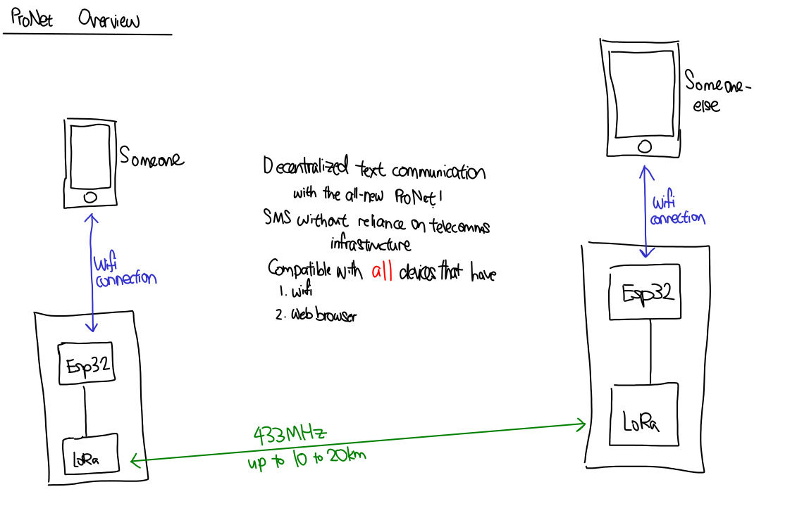

# ProNet
Decentralised networking for the average Jane.

## What it does

ProNet is a non-Internet equivalent of the Internet Relay Chat (IRC). Instead of relying on the Internet and on the complex telecommunication infrastructure network, ProNet uses LoRa radio to relay messages. This keeps users in touch even in events of disaster. Being in the unlicensed band, LoRa gives the average Jane without a HAM license the opportunity to keep in contact with others in the event of telecommunications failure. 

## Inspiration

We depend heavily on our telecommunication infrastructure to communicate with others, but that infrastructure is vulnerable. It can be disabled unexpectedly. How then can the average Jane communicate with family and friends? That problem is answered by ProNet

